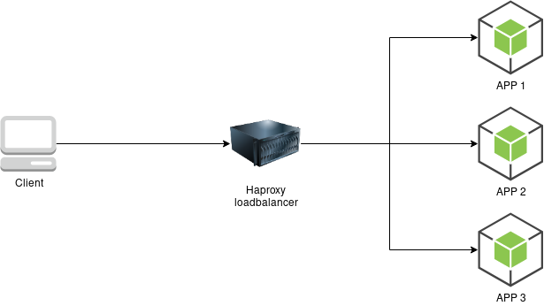

# Loadbalancer with nodejs containers

This repo is the implementation of Hussein Nasser's YouTube [tutorial](https://youtu.be/9sAg7RooEDc).

## Usage

1. clone the repo
1. use `docker-compose up` to spin up the containers
1. go to [http://localhost:8080](http://localhost:8080/who)

## Diagram

  

